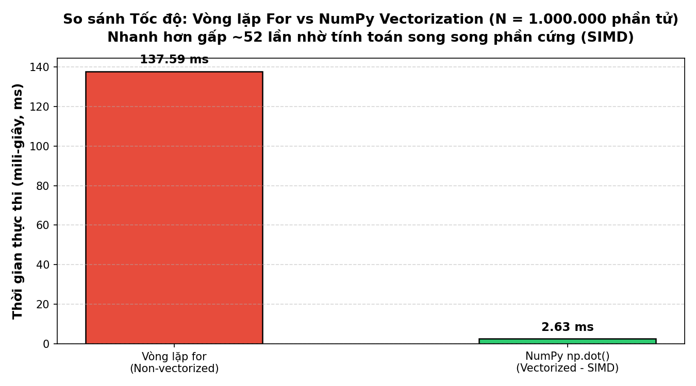
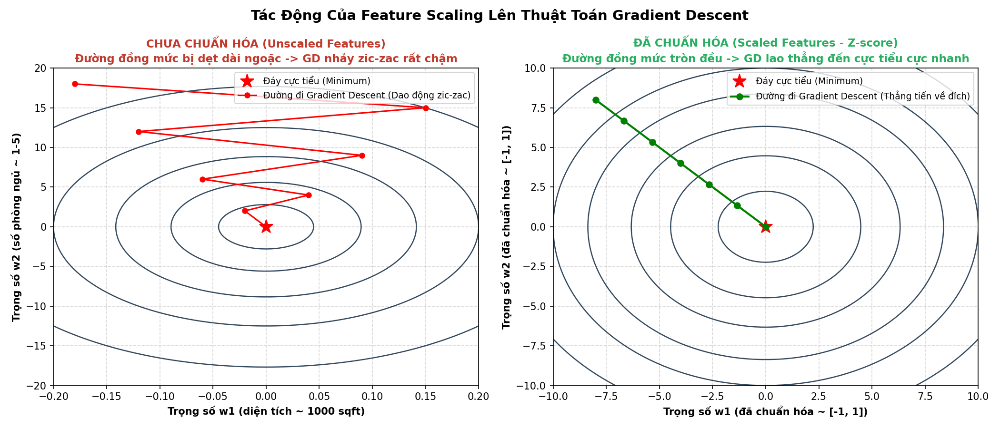

# Course 1: Supervised Machine Learning — Week 2
# Ghi chú Lý thuyết: Multiple Linear Regression & Practical Tricks

Tài liệu ghi chép chi tiết, trực quan theo phương pháp Fast-Track cho tuần học thứ 2.

---

## 1. Multiple Features (Hồi quy Tuyến tính Đa biến / Nhiều Đặc trưng)

### 🎯 Đặt vấn đề:
Ở Tuần 1, ta chỉ dự đoán giá nhà dựa trên một đặc trưng duy nhất là diện tích ($x$). Nhưng trong thực tế, giá nhà phụ thuộc vào rất nhiều yếu tố khác nhau:
- Diện tích sàn ($x_1$ - sqft)
- Số phòng ngủ ($x_2$)
- Số tầng ($x_3$)
- Tuổi thọ của ngôi nhà ($x_4$ - năm)

### 📐 Hệ thống ký hiệu toán học chuẩn mực (Mathematical Notation):
- $n$: Số lượng đặc trưng (Number of features). Ở ví dụ trên, $n = 4$.
- $m$: Số lượng mẫu dữ liệu huấn luyện (Number of training examples).
- $\mathbf{x}^{(i)}$: Vector chứa **toàn bộ các đặc trưng** của mẫu dữ liệu thứ $i$.
  - Đây là một vector hàng (hoặc vector 1D kích thước $n$):
  $$\mathbf{x}^{(i)} = \begin{bmatrix} x_1^{(i)} & x_2^{(i)} & \dots & x_n^{(i)} \end{bmatrix}$$
  - Ví dụ: $\mathbf{x}^{(2)} = [1416, 3, 2, 40]$ nghĩa là ngôi nhà thứ 2 rộng 1416 sqft, 3 phòng ngủ, 2 tầng, 40 năm tuổi.
- $x_j^{(i)}$: Giá trị của **đặc trưng thứ $j$** nằm trong **mẫu dữ liệu thứ $i$**.
  - Ví dụ: $x_3^{(2)} = 2$ (đặc trưng thứ 3 - số tầng của ngôi nhà thứ 2).

### 🏷️ Mô hình Hồi quy tuyến tính Đa biến (Model Representation):
- **Dạng đại số thông thường:**
  $$f(x) = w_1 x_1 + w_2 x_2 + \dots + w_n x_n + b$$
- **Dạng Vector (Vectorized Form):**
  - Đặt vector trọng số: $\mathbf{w} = \begin{bmatrix} w_1 & w_2 & \dots & w_n \end{bmatrix}$
  - Đặt vector đầu vào: $\mathbf{x} = \begin{bmatrix} x_1 & x_2 & \dots & x_n \end{bmatrix}$
  - $b$: Giá trị vô hướng (scalar - bias / intercept).
  - Mô hình được viết gọn gàng thành **Tích vô hướng (Dot Product)**:
  $$f_{\mathbf{w}, b}(\mathbf{x}) = \mathbf{w} \cdot \mathbf{x} + b = \left(\sum_{j=1}^n w_j x_j\right) + b$$

---

## 2. Vectorization (Kỹ thuật Vector hóa với NumPy)

### ⚡ Tại sao Vectorization là "vũ khí tối thượng" trong Machine Learning?
Trong Machine Learning và Deep Learning, ta thường phải tính toán trên hàng trăm ngàn đặc trưng và hàng triệu mẫu dữ liệu.



#### So sánh 2 cách code:
1. **Không vector hóa (Dùng vòng lặp `for` — Rất chậm):**
   ```python
   f = 0
   for j in range(n):
       f = f + w[j] * x[j]
   f = f + b
   ```
2. **Vector hóa với NumPy (`np.dot` — Cực nhanh & code ngắn 1 dòng):**
   ```python
   f = np.dot(w, x) + b
   ```

### 🖥️ Bản chất phần cứng: Tại sao `np.dot` nhanh gấp hàng chục đến hàng trăm lần?
- **Vòng lặp `for` (Tuần tự):** CPU chỉ dùng 1 luồng tính toán, phải nhân $w_0 \times x_0$, lưu kết quả tạm, rồi sang bước lặp kế tiếp nhân $w_1 \times x_1$... lặp lại $n$ lần.
- **NumPy `np.dot` (Song song phần cứng - Hardware Parallelism):**
  - Tận dụng các lệnh tối ưu hóa cao cấp trong CPU và GPU (tập lệnh **SIMD: Single Instruction, Multiple Data** như AVX/SSE trên Intel/AMD hay CUDA trên NVIDIA GPU).
  - Máy tính nạp nhiều cặp $(w_j, x_j)$ vào các thanh ghi vector chuyên dụng cùng lúc và **thực hiện phép nhân đồng loạt trong một chu kỳ xung nhịp**, sau đó cộng dồn với tốc độ ánh sáng!

---

## 3. Gradient Descent for Multiple Linear Regression

### 🥣 Hàm chi phí (Cost Function):
$$J(\mathbf{w}, b) = \frac{1}{2m} \sum_{i=1}^m \left( f_{\mathbf{w}, b}(\mathbf{x}^{(i)}) - y^{(i)} \right)^2$$
Trong đó $f_{\mathbf{w}, b}(\mathbf{x}^{(i)}) = \mathbf{w} \cdot \mathbf{x}^{(i)} + b$.

### 🔄 Thuật toán cập nhật Gradient Descent:
Lặp lại các bước sau cho đến khi hội tụ (Convergence):
$$\text{repeat until convergence: } \{$$
$$w_j := w_j - \alpha \frac{\partial J(\mathbf{w}, b)}{\partial w_j} \quad (\text{cho mọi } j = 1, 2, \dots, n)$$
$$b := b - \alpha \frac{\partial J(\mathbf{w}, b)}{\partial b}$$
$$\}$$

### 📐 Công thức đạo hàm riêng cụ thể:
1. **Đạo hàm theo từng tham số $w_j$:**
   $$\frac{\partial J(\mathbf{w}, b)}{\partial w_j} = \frac{1}{m} \sum_{i=1}^m \left( f_{\mathbf{w}, b}(\mathbf{x}^{(i)}) - y^{(i)} \right) x_j^{(i)}$$
2. **Đạo hàm theo hệ số tự do $b$:**
   $$\frac{\partial J(\mathbf{w}, b)}{\partial b} = \frac{1}{m} \sum_{i=1}^m \left( f_{\mathbf{w}, b}(\mathbf{x}^{(i)}) - y^{(i)} \right)$$

### ⚠️ Lưu ý sống còn:
- **Simultaneous Update:** Tất cả $n$ giá trị $w_1, w_2, \dots, w_n$ và $b$ phải được tính toán đạo hàm xong xuôi rồi mới cập nhật cùng lúc!
- **Đạo hàm theo $w_j$ có nhân với $x_j^{(i)}$:** Ở tuần 1 chỉ có 1 biến $x$ nên ta nhân với $x^{(i)}$. Ở tuần 2 có $n$ biến, muốn đạo hàm theo $w_j$ nào thì nhân với đúng đặc trưng $x_j^{(i)}$ tương ứng của biến đó!

---

## 4. Feature Scaling (Chuẩn hóa Thang đo Đặc trưng)

### 🎯 Tại sao cần Feature Scaling?
Giả sử ta có 2 đặc trưng:
- $x_1$ (Diện tích nhà): $300 \le x_1 \le 2000$ sqft.
- $x_2$ (Số phòng ngủ): $1 \le x_2 \le 5$ phòng.

Vì $x_1$ rất lớn nên chỉ cần một thay đổi nhỏ của $w_1$ sẽ làm dự đoán thay đổi dữ dội, trong khi $w_2$ cần thay đổi rất lớn mới ảnh hưởng đáng kể.



#### Bản chất hình học:
- **Khi CHƯA chuẩn hóa:** Đường đồng mức (contour plot) của hàm chi phí bị **kéo dài ngoằng, dẹt như hình quả dưa hấu hoặc quả trứng**. Vector gradient luôn vuông góc với đường đồng mức, khiến thuật toán Gradient Descent bị **dao động dội qua dội lại (zic-zac)** giữa 2 vách dốc hẹp, mất hàng chục ngàn bước lặp mới bò tới đáy.
- **Khi ĐÃ chuẩn hóa:** Đường đồng mức trở thành **các vòng tròn đồng tâm**. Gradient Descent sẽ **lao thẳng một mạch theo đường ngắn nhất tới đáy cực tiểu**!

### 🧪 3 Phương pháp Chuẩn hóa Thang đo:
1. **Chia cho giá trị lớn nhất (Feature Scaling by Max):**
   $$x_1 = \frac{x_1}{\max(x_1)}$$
   Đưa giá trị về khoảng $[0, 1]$.
2. **Chuẩn hóa trung bình (Mean Normalization):**
   $$x_1 = \frac{x_1 - \mu_1}{\max(x_1) - \min(x_1)}$$
   Trong đó $\mu_1$ là giá trị trung bình. Đưa giá trị về khoảng xấp xỉ $[-0.5, 0.5]$.
3. **Chuẩn hóa Z-score (Z-score Normalization — Phổ biến nhất trong thực tế):**
   $$x_1 = \frac{x_1 - \mu_1}{\sigma_1}$$
   Trong đó:
   - $\mu_1 = \frac{1}{m} \sum_{i=1}^m x_1^{(i)}$: Giá trị trung bình (Mean).
   - $\sigma_1 = \sqrt{\frac{1}{m} \sum_{i=1}^m (x_1^{(i)} - \mu_1)^2}$: Độ lệch chuẩn (Standard Deviation).
   - Sau khi chuẩn hóa: Trung bình bằng $0$ và độ lệch chuẩn bằng $1$. Phân phối dữ liệu nằm phần lớn trong khoảng $[-3, 3]$.

> 💡 **Quy tắc ngón tay cái (Rule of Thumb):**
> - Mục tiêu lý tưởng: Đưa mọi đặc trưng về khoảng $-1 \le x_j \le 1$.
> - Khoảng chấp nhận được: $-3 \le x_j \le 3$ hoặc $-0.3 \le x_j \le 0.3$.
> - Nếu một đặc trưng quá lớn (ví dụ $-100.000 \le x \le 100.000$) hoặc quá bé (ví dụ $0.0001 \le x \le 0.001$) $\implies$ **Bắt buộc phải áp dụng Feature Scaling!**

---

## 5. Checking Gradient Descent for Convergence (Kiểm tra Hội tụ)

### 📈 Đồ thị Đường cong Học tập (Learning Curve):
- Vẽ đồ thị hàm chi phí $J(\mathbf{w}, b)$ trên trục tung theo **số vòng lặp (Iterations)** trên trục hoành.
- **Dấu hiệu thuật toán chạy chuẩn:** Đường cong $J$ phải **liên tục giảm** sau mỗi vòng lặp và dần dần đi ngang (flatten out / hội tụ).
- **Dấu hiệu thuật toán bị lỗi:** Nếu $J$ tăng lên hoặc dao động hình sin $\implies$ **Tỷ lệ học $\alpha$ quá lớn** hoặc code tính gradient bị sai dấu!

### 🛑 Kiểm tra hội tụ tự động ($\epsilon$-test / Automatic Convergence Test):
- Chọn trước một ngưỡng nhỏ $\epsilon$ (ví dụ $\epsilon = 10^{-3} = 0.001$).
- Nếu sau 1 vòng lặp, mức giảm chi phí nhỏ hơn ngưỡng này:
  $$\Delta J = J_{\text{old}} - J_{\text{new}} \le \epsilon$$
- Thuật toán tuyên bố đã hội tụ (Converged) và dừng vòng lặp sớm.

---

## 6. Choosing the Learning Rate $\alpha$ (Chiến thuật chọn Tỷ lệ học)

- **Quy tắc vàng khi debug:** Hãy thử cho $\alpha$ cực kỳ nhỏ (ví dụ $\alpha = 0.00001$). Nếu với $\alpha$ siêu nhỏ mà $J$ vẫn không giảm sau mỗi vòng lặp $\implies$ Chắc chắn trong code có **bug** (thường là quên dấu trừ hoặc tính sai đạo hàm)!
- **Chiến lược dò tìm $\alpha$ tối ưu:** Thử nghiệm theo cấp số nhân (khoảng cách gấp ~3 lần):
  $$\dots, 0.001, 0.003, 0.01, 0.03, 0.1, 0.3, 1, \dots$$
- Vẽ đồ thị Learning Curve cho từng giá trị $\alpha$, chọn giá trị $\alpha$ lớn nhất mà đường cong $J$ vẫn giảm nhanh, mượt mà và không bị nhảy vọt/phân kỳ.

---

## 7. Feature Engineering & Polynomial Regression (Tạo đặc trưng & Hồi quy đa thức)

### 🛠️ 1. Feature Engineering (Kỹ thuật Tạo đặc trưng mới):
- Thay vì chỉ dùng các đặc trưng thô có sẵn từ dữ liệu, bạn có thể tự thiết kế đặc trưng mới bằng cách kết hợp toán học giữa các đặc trưng ban đầu để mô hình học tốt hơn.
- **Ví dụ:** Dự đoán giá đất:
  - Dữ liệu thô: Chiều rộng mảnh đất ($x_1$ - frontage) và Chiều sâu mảnh đất ($x_2$ - depth).
  - Ta có thể tạo đặc trưng mới: **Diện tích mảnh đất** $x_3 = x_1 \times x_2$.
  - Mô hình trở thành: $f(x) = w_1 x_1 + w_2 x_2 + w_3 x_3 + b$. Diện tích $x_3$ thường có tương quan tuyến tính mạnh hơn nhiều so với từng chiều riêng lẻ!

### 📈 2. Polynomial Regression (Hồi quy Đa thức):
- Khi dữ liệu thực tế không đi theo một đường thẳng mà uốn cong (phi tuyến):
  - Ví dụ giá nhà tăng chậm lại khi diện tích quá lớn.
- Ta có thể đưa thêm các số mũ của biến vào mô hình:
  $$f_{\mathbf{w}, b}(x) = w_1 x + w_2 x^2 + w_3 x^3 + b$$
  Hoặc dùng căn bậc hai:
  $$f_{\mathbf{w}, b}(x) = w_1 x + w_2 \sqrt{x} + b$$
- **Bản chất Machine Learning:** Về mặt đại số, đây vẫn là một bài toán **Hồi quy Tuyến tính Đa biến (Multiple Linear Regression)**, trong đó ta đặt:
  $x_1 = x, \quad x_2 = x^2, \quad x_3 = x^3$.

> ⚠️ **BẪY THI TRẮC NGHIỆM SỐNG CÒN:**
> Khi dùng Polynomial Regression, khoảng giá trị của các đặc trưng bị chênh lệch cực kỳ khủng khiếp:
> - Giả sử $x \in [1, 1000]$.
> - Thì $x^2 \in [1, 1.000.000]$.
> - Và $x^3 \in [1, 1.000.000.000]$!
> $\implies$ **BẮT BUỘC PHẢI DÙNG FEATURE SCALING** (Z-score normalization) trước khi chạy Gradient Descent, nếu không mô hình sẽ bị phân kỳ hoặc chạy chậm không tưởng!

