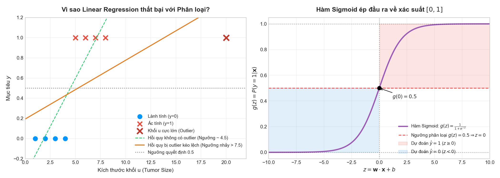
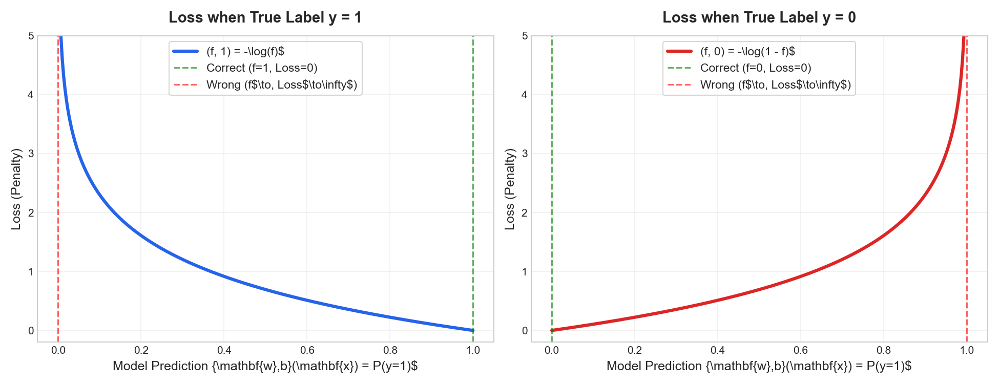
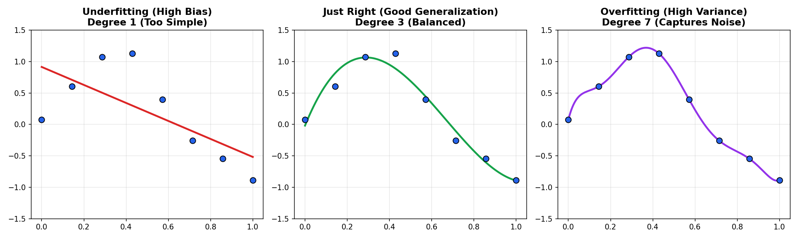

# Course 1: Supervised Machine Learning — Week 3
# Classification & Logistic Regression (Ghi Chú Đúc Kết Lý Thuyết Thực Chiến)

---

## 🧭 Bức Tranh Tổng Quan Tuần 3 (Tuần Cuối Khóa 1)

Tuần 3 là bước chuyển dịch quan trọng nhất từ **Bài toán Hồi quy (Regression - dự đoán số liên tục)** sang **Bài toán Phân loại (Classification - dự đoán nhãn rời rạc)**:
- Dự đoán email: Spam ($y=1$) hay Không Spam ($y=0$).
- Chẩn đoán y khoa: Khối u Ác tính ($y=1$) hay Lành tính ($y=0$).
- Giao dịch tài chính: Gian lận ($y=1$) hay Hợp lệ ($y=0$).

---

## 📌 PHẦN 1: BẢN CHẤT CỦA PHÂN LOẠI & HỒI QUY LOGISTIC (LOGISTIC REGRESSION)

### 1.1. Vì sao Hồi quy Tuyến tính (Linear Regression) thất bại khi Phân loại?

Giả sử ta cố tình dùng Linear Regression $f_{\mathbf{w},b}(x) = wx + b$ cho bài toán nhị phân với quy tắc ngưỡng:
- Nếu $f(x) \ge 0.5 \implies \hat{y} = 1$.
- Nếu $f(x) < 0.5 \implies \hat{y} = 0$.

Có **2 điểm yếu chí tử**:
1. **Rất nhạy cảm với điểm ngoại lai (Outliers):** Nếu có một bệnh nhân với khối u cực lớn nằm tít bên phải (outlier), đường hồi quy bị kéo lệch dốc xuống để giảm thiểu bình phương sai số. Hệ quả: Ngưỡng phân loại $0.5$ bị đẩy vọt sang phải, khiến hàng loạt bệnh nhân có khối u ác tính bị đoán sai thành lành tính!
2. **Dự đoán vô nghĩa:** Đường thẳng tuyến tính có giá trị chạy từ $-\infty \ đến \ +\infty$. Trong khi xác suất chỉ được phép nằm trong đoạn $[0, 1]$. Một mô hình dự đoán xác suất ung thư là $-0.8$ hoặc $+2.5$ là hoàn toàn phi lý.

---

### 1.2. Mô hình Hồi quy Logistic & Hàm Sigmoid

Để ép toàn bộ đầu ra luôn nằm trọn vẹn trong khoảng xác suất $[0, 1]$, ta truyền giá trị tuyến tính $z = \mathbf{w} \cdot \mathbf{x} + b$ qua **Hàm Sigmoid** (còn gọi là **Logistic Function**):

$$g(z) = \frac{1}{1 + e^{-z}}$$

#### Các tính chất đặc biệt của Sigmoid:
- Khi $z \to +\infty$: $e^{-z} \to 0 \implies g(z) \to \frac{1}{1 + 0} = 1$.
- Khi $z \to -\infty$: $e^{-z} \to +\infty \implies g(z) \to 0$.
- Khi $z = 0$: $e^0 = 1 \implies g(0) = \frac{1}{1 + 1} = 0.5$.

#### Định nghĩa Mô hình Logistic Regression:
$$f_{\mathbf{w}, b}(\mathbf{x}) = g(\mathbf{w} \cdot \mathbf{x} + b) = \frac{1}{1 + e^{-(\mathbf{w} \cdot \mathbf{x} + b)}}$$

#### Ý nghĩa Xác suất (Probabilistic Interpretation):
$$f_{\mathbf{w}, b}(\mathbf{x}) = P(y = 1 \mid \mathbf{x}; \mathbf{w}, b)$$
*(Xác suất để nhãn $y=1$ khi biết đặc trưng $\mathbf{x}$, phụ thuộc tham số $\mathbf{w}, b$)*.

Vì tổng xác suất của 2 biến cố đối lập luôn bằng $1$:
$$P(y = 0 \mid \mathbf{x}) = 1 - P(y = 1 \mid \mathbf{x}) = 1 - f_{\mathbf{w}, b}(\mathbf{x})$$

Ví dụ: Nếu mô hình cho $f_{\mathbf{w},b}(\mathbf{x}) = 0.7$, điều đó nghĩa là bệnh nhân có **70% khả năng bị u ác tính ($y=1$)**, và **30% khả năng lành tính ($y=0$)**.

---

### 1.3. Ranh Giới Quyết Định (Decision Boundary)

Để biến xác suất $f(\mathbf{x}) \in [0, 1]$ thành nhãn dự đoán $\hat{y} \in \{0, 1\}$, ta đặt một **ngưỡng quyết định (Decision Threshold)** thông thường là $0.5$:
- Dự đoán $\hat{y} = 1$ khi: $f_{\mathbf{w},b}(\mathbf{x}) \ge 0.5 \iff z \ge 0 \iff \mathbf{w} \cdot \mathbf{x} + b \ge 0$.
- Dự đoán $\hat{y} = 0$ khi: $f_{\mathbf{w},b}(\mathbf{x}) < 0.5 \iff z < 0 \iff \mathbf{w} \cdot \mathbf{x} + b < 0$.

Phương trình đường biên phân chia 2 miền chính là:
$$\mathbf{w} \cdot \mathbf{x} + b = 0 \quad \text{(Decision Boundary)}$$

> **QUAN TRỌNG:** Ranh giới quyết định là thuộc tính của **mô hình và các tham số $(\mathbf{w}, b)$**, **KHÔNG** phụ thuộc vào việc tập dữ liệu huấn luyện có bao nhiêu điểm sau khi mô hình đã học xong.

#### A. Ranh giới Tuyến tính (Linear Decision Boundary)
Với 2 đặc trưng $x_1, x_2$, nếu $z = w_1 x_1 + w_2 x_2 + b = 0$, ranh giới là một **đường thẳng**:
$$x_2 = -\frac{w_1}{w_2} x_1 - \frac{b}{w_2}$$

#### B. Ranh giới Phi tuyến (Non-linear Decision Boundary)
Tương tự như Polynomial Regression ở Tuần 2, ta có thể dùng **Feature Engineering** (bổ sung các số hạng bậc cao $x_1^2, x_2^2, x_1 x_2$) để uốn cong ranh giới quyết định!

Ví dụ: Chọn $z = x_1^2 + x_2^2 - 1$.
Ranh giới quyết định $z = 0 \implies x_1^2 + x_2^2 = 1$.
$\implies$ Đây là một **đường tròn bán kính 1**!
- Mọi điểm nằm ngoài hoặc trên đường tròn ($x_1^2 + x_2^2 \ge 1$) được dự đoán $\hat{y} = 1$ (vì $z \ge 0 \implies g(z) \ge 0.5$).
- Mọi điểm nằm bên trong đường tròn ($x_1^2 + x_2^2 < 1$) được dự đoán $\hat{y} = 0$ (vì $z < 0 \implies g(z) < 0.5$).

> 💡 **BẢN CHẤT: Tại sao có khi NẰM TRONG là 1, có khi NẰM NGOÀI là 1?**
> Việc miền bên trong hay bên ngoài đường tròn nhận nhãn $\hat{y} = 1$ hoàn toàn phụ thuộc vào **dấu của các trọng số $\mathbf{w}$ và $b$** mà mô hình học được:
> - **Trường hợp nhãn 1 ở NGOÀI:** Mô hình học ra các trọng số dương $z = x_1^2 + x_2^2 - 1$. Muốn $z \ge 0 \iff x_1^2 + x_2^2 \ge 1$ (ngoài đường tròn). Thử tâm $(0, 0) \implies z = -1 < 0 \implies \hat{y} = 0$.
> - **Trường hợp nhãn 1 ở TRONG (như bài tập kiểm định vi mạch chip):** Nhãn 1 gom cụm ở tâm, nhãn 0 bao quanh. Mô hình sẽ học ra các trọng số âm $z = 1 - x_1^2 - x_2^2$. Muốn $z \ge 0 \iff 1 - x_1^2 - x_2^2 \ge 0 \iff x_1^2 + x_2^2 \le 1$ (**TRONG đường tròn**). Thử tâm $(0, 0) \implies z = 1 > 0 \implies \hat{y} = 1$.

---

## 📌 PHẦN 2: HÀM MẤT MÁT (LOSS FUNCTION) & HÀM CHI PHÍ (COST FUNCTION)

### 2.1. Vì sao hàm Bình phương Sai số (Squared Error Cost) thất bại với Logistic Regression?

Trong Linear Regression, hàm chi phí bình phương sai số:
$$J(\mathbf{w}, b) = \frac{1}{2m} \sum_{i=1}^{m} (f_{\mathbf{w},b}(\mathbf{x}^{(i)}) - y^{(i)})^2$$
có dạng **Lồi (Convex)** — giống như một chiếc bát úp ngược, chỉ có duy nhất 1 điểm cực tiểu toàn cục (Global Minimum). Gradient Descent luôn tìm được điểm tối ưu.

Nhưng trong Logistic Regression, vì $f_{\mathbf{w},b}(\mathbf{x}) = \frac{1}{1 + e^{-(\mathbf{w} \cdot \mathbf{x} + b)}}$ là hàm phi tuyến phức tạp:
- Nếu đưa Sigmoid vào hàm bình phương sai số, bề mặt hàm chi phí sẽ trở thành **Không lồi (Non-convex)**.
- Đồ thị sẽ lồi lõm với vô số **Điểm cực tiểu địa phương (Local Minima)**!
- Hệ quả: Gradient Descent dễ bị "mắc kẹt" tại các hố địa phương và không bao giờ tìm được bộ trọng số tốt nhất.

---

### 2.2. Hàm Mất Mát Logistic (Logistic Loss / Binary Cross-Entropy)

Để đảm bảo hàm chi phí luôn **Lồi (Convex)**, Andrew Ng giới thiệu hàm mất mát riêng cho từng điểm dữ liệu:

$$L(f_{\mathbf{w},b}(\mathbf{x}), y) = 
\begin{cases} 
-\log(f_{\mathbf{w},b}(\mathbf{x})) & \text{khi } y = 1 \\ 
-\log(1 - f_{\mathbf{w},b}(\mathbf{x})) & \text{khi } y = 0 
\end{cases}$$

#### Trực giác sâu sắc:
1. **Khi nhãn thực tế $y = 1$:**
   - Nếu mô hình dự đoán $f(\mathbf{x}) = 1$ (chuẩn xác 100%): Mất mát $L = -\log(1) = 0$.
   - Nếu mô hình dự đoán $f(\mathbf{x}) \to 0$ (hoàn toàn sai): Mất mát $L = -\log(\to 0) \to +\infty$!
   - *Mô hình bị phạt vô cùng nặng nếu đoán lệch hẳn so với thực tế.*
2. **Khi nhãn thực tế $y = 0$:**
   - Nếu mô hình dự đoán $f(\mathbf{x}) = 0$ (chuẩn xác 100%): Mất mát $L = -\log(1 - 0) = -\log(1) = 0$.
   - Nếu mô hình dự đoán $f(\mathbf{x}) \to 1$ (hoàn toàn sai): Mất mát $L = -\log(1 - 1) = -\log(0) \to +\infty$!

#### Viết gộp thành một công thức duy nhất (Simplified Loss):
Vì $y \in \{0, 1\}$, ta tận dụng cơ chế bật/tắt để gộp:
$$L(f_{\mathbf{w},b}(\mathbf{x}), y) = -y \log(f_{\mathbf{w},b}(\mathbf{x})) - (1 - y) \log(1 - f_{\mathbf{w},b}(\mathbf{x}))$$
- Khi $y = 1$: Vế sau $(1 - 1) = 0$ biến mất, chỉ còn $-\log(f(\mathbf{x}))$.
- Khi $y = 0$: Vế trước $(0) = 0$ biến mất, chỉ còn $-\log(1 - f(\mathbf{x}))$.

---

### 2.3. Hàm Chi Phí Hoàn Chỉnh (Cost Function)

Lấy trung bình cộng mất mát trên toàn bộ $m$ mẫu huấn luyện:
$$J(\mathbf{w}, b) = -\frac{1}{m} \sum_{i=1}^{m} \left[ y^{(i)} \log(f_{\mathbf{w},b}(\mathbf{x}^{(i)})) + (1 - y^{(i)}) \log(1 - f_{\mathbf{w},b}(\mathbf{x}^{(i)})) \right]$$

Hàm chi phí này được rút ra từ nguyên lý **Maximum Likelihood Estimation (Ước lượng Hợp lý Cực đại)** trong thống kê và **được chứng minh là Convex (Lồi)**!

---

### 2.4. Thuật toán Gradient Descent cho Logistic Regression

Công thức cập nhật đồng thời (simultaneous update) cho mọi $j \in \{1, \dots, n\}$ và $b$:
$$\begin{aligned}
w_j &:= w_j - \alpha \frac{\partial J(\mathbf{w}, b)}{\partial w_j} = w_j - \alpha \frac{1}{m} \sum_{i=1}^{m} (f_{\mathbf{w},b}(\mathbf{x}^{(i)}) - y^{(i)}) x_j^{(i)} \\
b &:= b - \alpha \frac{\partial J(\mathbf{w}, b)}{\partial b} = b - \alpha \frac{1}{m} \sum_{i=1}^{m} (f_{\mathbf{w},b}(\mathbf{x}^{(i)}) - y^{(i)})
\end{aligned}$$

> ⚠️ **BẪY TƯ DUY KINH ĐIỂN:** 
> Trông công thức đạo hàm Gradient Descent của Logistic Regression **y hệt** Linear Regression! 
> Nhưng bản chất **khác hoàn toàn** ở hàm dự đoán $f_{\mathbf{w},b}(\mathbf{x})$:
> - Linear Regression: $f_{\mathbf{w},b}(\mathbf{x}) = \mathbf{w} \cdot \mathbf{x} + b$
> - Logistic Regression: $f_{\mathbf{w},b}(\mathbf{x}) = g(\mathbf{w} \cdot \mathbf{x} + b) = \frac{1}{1 + e^{-(\mathbf{w} \cdot \mathbf{x} + b)}}$

---

## 📌 PHẦN 3: VẤN ĐỀ QUÁ KHỚP (OVERFITTING) & KỸ THUẬT REGULARIZATION

### 3.1. Phân biệt Underfitting vs Just Right vs Overfitting

| Trạng thái | Thuật ngữ chuyên ngành | Bản chất | Dấu hiệu nhận biết |
| :--- | :--- | :--- | :--- |
| **Underfitting** | **High Bias (Độ chệch cao)** | Mô hình quá đơn giản (ví dụ dùng đường thẳng ép vào tập dữ liệu parabol). | Sai số huấn luyện cao (High train error), sai số kiểm thử cao. |
| **Just Right** | **Generalization (Tổng quát hóa tốt)** | Mô hình nắm bắt đúng quy luật ẩn sâu bên dưới dữ liệu. | Sai số huấn luyện thấp, sai số kiểm thử thấp. |
| **Overfitting** | **High Variance (Phương sai cao)** | Mô hình quá phức tạp, học vẹt cả nhiễu (noise) của tập huấn luyện. | Sai số huấn luyện cực thấp (gần bằng 0), nhưng mang đi kiểm tra thực tế thì sai bét! |

---

### 3.2. Ba cách đối phó với Overfitting
1. **Thu thập thêm dữ liệu huấn luyện (Get more training data):** Cách tốt nhất nếu khả thi. Thêm dữ liệu giúp mô hình phân biệt quy luật cốt lõi với nhiễu ngẫu nhiên.
2. **Chọn lọc đặc trưng (Feature Selection):** Bỏ bớt các đặc trưng dư thừa hoặc gây nhiễu.
3. **Chính quy hóa (Regularization):** Giữ lại toàn bộ đặc trưng, nhưng **phạt (penalize) các trọng số lớn** để ép chúng co về gần 0, giúp đường biên/đường cong trở nên mượt mà và đơn giản hơn!

---

### 3.3. Toán học của L2 Regularization (Ridge)

Ta cộng thêm một số hạng phạt vào hàm chi phí:
$$J_{\text{reg}}(\mathbf{w}, b) = J(\mathbf{w}, b) + \frac{\lambda}{2m} \sum_{j=1}^{n} w_j^2$$

- $\lambda \ge 0$ là **Tham số chính quy hóa (Regularization Parameter)**.
- Chia cho $2m$ để khi tính đạo hàm, số $2$ triệt tiêu với mũ 2, giữ công thức gọn gàng.
- **Lưu ý:** Theo thông lệ, ta **KHÔNG phạt hệ số tự do $b$** (chỉ phạt các trọng số $w_1, \dots, w_n$).

#### Tác động của hệ số $\lambda$:
- Nếu $\lambda = 0$: Mô hình không bị ràng buộc $\implies$ Dễ bị **Overfitting**.
- Nếu $\lambda$ vừa phải (optimal): Cân bằng hoàn hảo giữa việc khớp dữ liệu và giữ trọng số nhỏ $\implies$ **Just Right**.
- Nếu $\lambda$ quá lớn (ví dụ $\lambda = 10^{10}$): Mọi $w_j \approx 0 \implies f(\mathbf{x}) \approx b$ (đường nằm ngang) $\implies$ Bị **Underfitting**!

---

### 3.4. Gradient Descent với Regularization

Khi đạo hàm hàm chi phí có số hạng phạt:
$$\frac{\partial J_{\text{reg}}}{\partial w_j} = \frac{\partial J}{\partial w_j} + \frac{\lambda}{m} w_j$$

Công thức cập nhật trở thành:
$$w_j := w_j - \alpha \left[ \frac{\partial J}{\partial w_j} + \frac{\lambda}{m} w_j \right] = w_j \left( 1 - \alpha \frac{\lambda}{m} \right) - \alpha \frac{\partial J}{\partial w_j}$$

> 💡 **TRỰC GIÁC VÀNG (Weight Decay):**
> Vì $\alpha$ nhỏ và $\frac{\lambda}{m} > 0$, hệ số $\left(1 - \alpha \frac{\lambda}{m}\right)$ luôn là một số **nhỏ hơn 1 một chút** (ví dụ $0.99$).
> Điều này có nghĩa là ở mỗi vòng lặp, trước khi trừ đi bước nhảy gradient thông thường, $w_j$ bị **thu nhỏ đi một chút xíu (co lại về 0)**!

---

## ⚡ TỔNG HỢP BẪY TRẮC NGHIỆM TUẦN 3 (QUIZ TRAPS FAST-TRACK)

1. **Bẫy 1:** *Có phạt tham số $b$ trong Regularization không?*
   - ❌ Thường không. Phạt $b$ không có ý nghĩa giảm overfitting mà chỉ dịch chuyển toàn bộ đồ thị theo trục tung.
2. **Bẫy 2:** *Nếu mô hình bị Overfitting, tăng $\lambda$ hay giảm $\lambda$?*
   - ✅ **Tăng $\lambda$** để phạt mạnh hơn các trọng số lớn, làm mượt mô hình.
3. **Bẫy 3:** *Nếu mô hình bị Underfitting, tăng $\lambda$ hay giảm $\lambda$?*
   - ✅ **Giảm $\lambda$** (hoặc chọn mô hình phức tạp hơn, thêm polynomial features).
4. **Bẫy 4:** *Vì sao hàm mất mát $L(f, y)$ lại có dấu trừ đằng trước?*
   - ✅ Vì xác suất $f \in (0, 1)$, $\log(f)$ luôn là một số âm. Dấu trừ đằng trước giúp giá trị mất mát luôn là một số dương ($\ge 0$).
5. **Bẫy 5:** *Công thức cập nhật gradient descent của Linear Regression và Logistic Regression có giống nhau không?*
   - ✅ Biểu thức đại số bề ngoài giống nhau: $\frac{1}{m} \sum (f - y) x_j$. Nhưng bản chất bên trong hàm $f$ khác nhau hoàn toàn: một bên là tuyến tính $wx+b$, một bên là hàm sigmoid $g(wx+b)$.

---

## 🗺️ LỘ TRÌNH THỰC HÀNH TUẦN 3

Toàn bộ 9 Optional Labs và 1 Bài tập chấm điểm (Graded Assignment) đã sẵn sàng, tương thích 100% KaTeX trong VS Code:

1. `C1_W3_Lab01_Classification_Soln.ipynb`: Trực quan hóa thất bại của Linear Regression trên phân loại.
2. `C1_W3_Lab02_Sigmoid_function_Soln.ipynb`: Khám phá đồ thị và cài đặt hàm Sigmoid $g(z)$.
3. `C1_W3_Lab03_Decision_Boundary_Soln.ipynb`: Phân tích ranh giới quyết định tuyến tính và phi tuyến (đường tròn).
4. `C1_W3_Lab04_LogisticLoss_Soln.ipynb`: Khám phá hàm mất mát Logistic so với Squared Error.
5. `C1_W3_Lab05_Cost_Function_Soln.ipynb`: Cài đặt hàm chi phí $J(\mathbf{w}, b)$.
6. `C1_W3_Lab06_Gradient_Descent_Soln.ipynb`: Chạy gradient descent tìm tham số tối ưu.
7. `C1_W3_Lab07_Scikit_Learn_Soln.ipynb`: Huấn luyện Logistic Regression bằng `sklearn.linear_model.LogisticRegression`.
8. `C1_W3_Lab08_Overfitting_Soln.ipynb`: Minh họa Underfitting vs Overfitting bằng trực quan tương tác.
9. `C1_W3_Lab09_Regularization_Soln.ipynb`: Cài đặt chi phí và gradient có L2 Regularization.
10. `C1_W3_Logistic_Regression.ipynb`: **Bài tập lập trình chấm điểm tổng hợp Tuần 3**.
